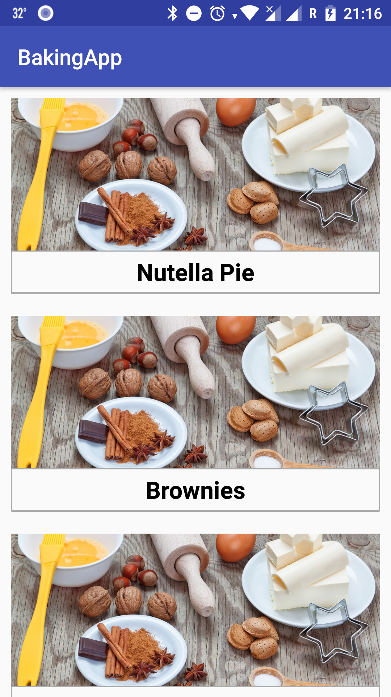

# BakingApp

Udacity - Android Developer Nanodegree - "Advanced Android App Development" - Baking App

<h2>Project Overview</h2>

You will productionize an app, taking it from a functional state to a production-ready state. This will involve finding and handling error cases, adding accessibility features, allowing for localization, adding a widget, and adding a library.

<h2>Why this Project?</h2>

As a working Android developer, you often have to create and implement apps where you are responsible for designing and planning the steps you need to take to create a production-ready app. Unlike Popular Movies where we gave you an implementation guide, it will be up to you to figure things out for the Baking App.

<h2>What Will I Learn?</h2>

In this project you will:

<ul>
  <li>Use MediaPlayer/Exoplayer to display videos.</li>
  <li>Handle error cases in Android.</li>
  <li>Add a widget to your app experience.</li>
  <li>Leverage a third-party library in your app.</li>
  <li>Use Fragments to create a responsive design that works on phones and tablets.</li>
</ul>

<h2>App Description</h2>

Your task is to create a Android Baking App that will allow Udacity’s resident baker-in-chief, Miriam, to share her recipes with the world. You will create an app that will allow a user to select a recipe and see video-guided steps for how to complete it.

The recipe listing is located <a href="http://go.udacity.com/android-baking-app-json">here</a>

The JSON file contains the recipes' instructions, ingredients, videos and images you will need to complete this project. Don’t assume that all steps of the recipe have a video. Some may have a video, an image, or no visual media at all.

One of the skills you will demonstrate in this project is how to handle unexpected input in your data -- professional developers often cannot expect polished JSON data when building an app.

<h2>Sample Mocks</h2>

<a href="https://go.udacity.com/android-baking-app-mocks-pdf">Available here

  
<h2>Screenshots</h2>

